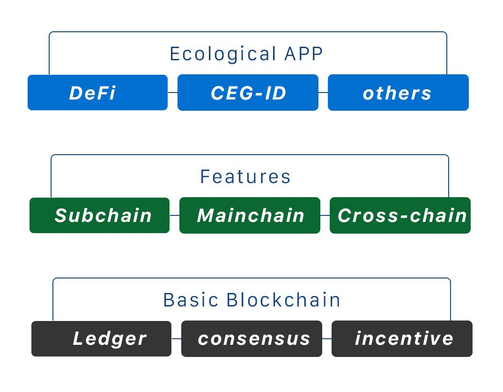

## __What is CEG__
CEG (Circular Economy Global) is a public chain project, supports the development of smart contracts by the Solidity technologies. Support privacy protection based on ring signature, and Decentralized cross-chain transactions. CEG's Storeman node group combines Secure Multi-Party Computation, Atomic swap, Threshold Key Sharing, Distributed account management and others Cryptography technologies to achieved complete the  decentralized cross-chain solution.  

Developers can write smart contracts, develop DApps, and issue Fungible Tokens or Non-fungible Tokens on the CEG platform. Based on the cross-chain mechanism, CEG will open up assets on different chains, whether those assets come from a public chain, a private chain or an alliance chain to flow freely between those different chains.

## __Features of CEG__
- Realize the global circulation of data value at low cost and low risk
- Widely compatible account structure
- Use MPT (Merkle Patricia Tree) for ledger data storage
- Built a dedicated distributed storage engine database - ChainDB on TiDB technology
- High-performance transaction processing with 1000 TPS
- Cross-chain system to achieve interconnection

## __Architecture of CEG__

